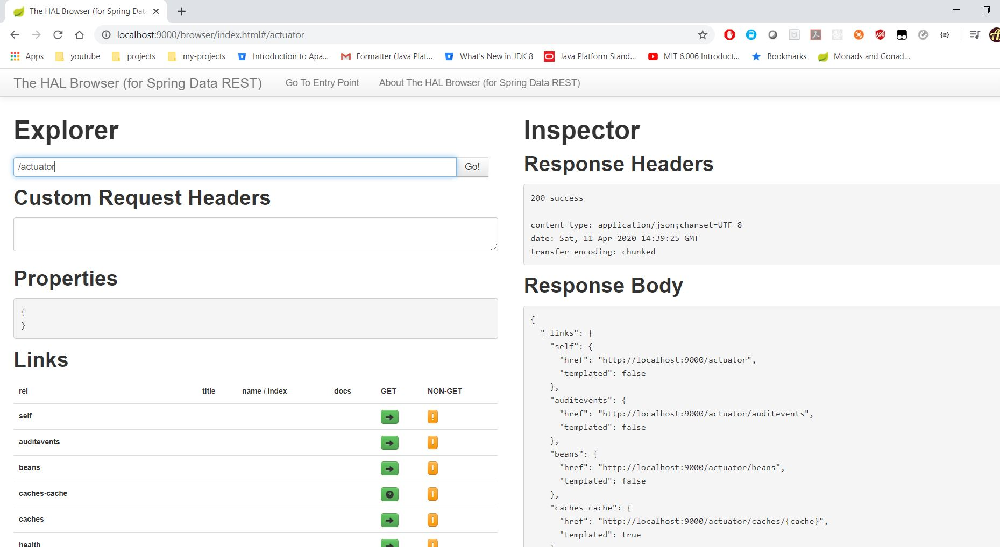

# Spring Boot 2 Actuator

## Maven command
```
mvn archetype:generate -DgroupId=spring.boot.actuator -DartifactId=spring-boot-actuator -Dversion=1.0 -DarchetypeArtifactId=maven-archetype-quickstart -DinteractiveMode=false
```

## Gradle command
```
gradle init --type pom
```

## Property to disable security on actuator end points
```
management.security.enabled=false
```

## Steps
* Add dependency. Refer [pom.xml](pom.xml) (or) [build.gradle](build.gradle)
    * spring-boot-starter-actuator
    * spring-data-rest-hal-browser
* Import [spring-boot-actuator.postman_collection.json](files/spring-boot-actuator.postman_collection.json) to postman to execute actuator end points
* [References](#References) to see full list of end points

## Custom actuator end points
* Create a class that implements `org.springframework.boot.actuate.health.HealthIndicator`
* Override health() method
* Refer [AppHealthIndicator.java](src/main/java/spring/boot/actuator/custom/actuators/AppHealthIndicator.java)
* Open url - http://localhost:9091/actuator/health

## Information to /info end point
* All below properties in [application.properties](src/main/resources/application.properties)
```
info.app.name=spring-boot-actuator-practice-examples
info.app.description=Spring Boot Actuator Practice Examples
info.app.version=1.0
info.java-vendor = ${java.specification.vendor}
```
* Check `info` API in [spring-boot-actuator.postman_collection.json](files/spring-boot-actuator.postman_collection.json)

## Custom information to /info end point
* Write a class that implements `org.springframework.boot.actuate.info.InfoContributor`
* Override `contribute(..)` method
* Add information needed to `org.springframework.boot.actuate.info.Info.Builder` object which is an argument to `contribute(..)` method 
* Refer [InfoContributorComponent.java](src/main/java/spring/boot/actuator/component/InfoContributorComponent.java)
* Check `info` API in [spring-boot-actuator.postman_collection.json](files/spring-boot-actuator.postman_collection.json)

## Spring boot actuator hal browser
* Add `spring-data-rest-hal-browser` dependency in [pom.xml](pom.xml) (or) [build.gradle](build.gradle)
* Start the application. Run [App.java](src/main/java/spring/boot/actuator/App.java)
* open - http://localhost:9000/browser/index.html
    * Here we can see all actuator end points in UI
    * In **Explorer** enter `/actuator` press `Go` button
    * We can access actuator end points from here


## Postman Collection
* Refer [spring-boot-actuator.postman_collection.json](files/spring-boot-actuator.postman_collection.json)

## Some End Points
* /acutator
* /health
* /autoconfig
* /beans
* /configprops
* /dump

## References
* https://dzone.com/articles/spring-boot-actuator-in-spring-boot-20
* https://www.baeldung.com/spring-boot-actuators
* https://docs.spring.io/spring-boot/docs/current/reference/html/production-ready-endpoints.html

## Run from IDE
* Import project into IDE as Maven or Gradle project
* Execute [App.java](src/main/java/spring/boot/actuator/App.java)

## Run using maven executive plugin
```
mvn clean compile exec:java
```

## Run using spring boot maven plugin
```
mvn clean compile spring-boot:run
```

## Run using spring boot gradle plugin
```
gradlew clean compileJava bootRun
```

## Create package using maven
```
mvn clean compile package
```

## Execute jar of Maven
```
java -jar target\spring-boot-actuator.jar
```

## Create package using gradle
```
gradlew clean compileJava build
```

## Execute jar of Gradle
```
java -jar build\libs\spring-boot-actuator-1.0.jar
```
