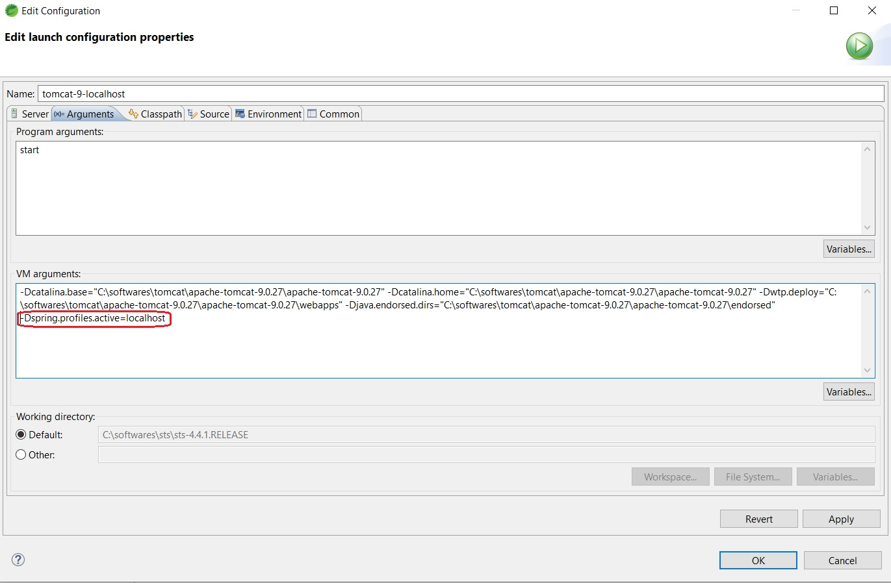

# Spring Boot War

## Problem Statement
* Create Spring Boot War
* Deploy to Tomcat 9
* Declare JNDI in Tomcat 9
* Connect to DB using JNDI declared in Tomcat 9
* Query Employee table, return result in JSON

## Create project using maven
```
mvn archetype:generate -DgroupId=com.spring.boot2.war.tomcat9 -DartifactId=war-to-tomacat9 -Dversion=1.0 -DarchetypeArtifactId=maven-archetype-quickstart -DinteractiveMode=false
```

## Add gradle
```
gradle init --type pom
```

## Steps
* Make `spring-boot-starter-tomcat` as provided
* Refer - [pom.xml](pom.xml)
```
<dependency>
	<groupId>org.springframework.boot</groupId>
	<artifactId>spring-boot-starter-tomcat</artifactId>
	<scope>provided</scope>
</dependency>
```
* Refer - [build.gradle](build.gradle)
```
providedRuntime 'org.springframework.boot:spring-boot-starter-tomcat'
```
* Make package type as `war`
* Refer - [pom.xml](pom.xml)
```
<packaging>war</packaging>
```
* Refer - [build.gradle](build.gradle)
```
apply plugin: 'war'
```
* Main class extends `SpringBootServletInitializer` and override `configure(SpringApplicationBuilder builder)` method. Refer [src/main/java/com/spring/boot2/war/tomcat9/App.java](src/main/java/com/spring/boot2/war/tomcat9/App.java)
* Declare JNDI in Tomcat 9
	* Open `Tomcat-installation-directory/conf/context.xml` give following entry
```
<Resource auth="Container" driverClassName="com.mysql.cj.jdbc.Driver" global="jdbc/MyDB" 
    	maxTotal="100" maxIdle="20" maxWaitMillis="10000" minIdle="5" name="jdbc/MyDB" 
    	password="your-db-password" type="javax.sql.DataSource" url="jdbc:mysql://localhost:3306/practice" 
    	username="your-db-username"/>
```
* Use JNDI in [src/main/resources/application.yml](src/main/resources/application.yml)
```
spring.datasource.jndi-name=java:comp/env/jdbc/MyDB
```
* Deploy to tomcat

## API
* Refer [files/war-to-tomacat9.postman_collection.json](files/war-to-tomacat9.postman_collection.json)

## Run this project
* Import project into IDE as **Maven** or **Gradle** project
* configure tomcat in IDE
* Deploy application to tomcat from IDE
* Start tomcat
* Import postman collection to postman - [files/war-to-tomacat9.postman_collection.json](files/war-to-tomacat9.postman_collection.json)
* Access APIs

## Deploy war manually - Maven
* Create war
```
mvn clean package
```
* Copy **target/war-to-tomacat9.war** to **Tomcat/../webapps** folder

## Deploy war manually - Gradle
* Create war
```
gradlew clean build
```
* Copy **build/libs/war-to-tomacat9.war** to **Tomcat/../webapps** folder

## Pass spring profile as argument from tomcat
### Solution 1
* Add profiles in [src/main/resources/application.yml](src/main/resources/application.yml)
* Double click on tomcat configured in STS/Eclipse
* Click `Open launch configuration`
* Go to `Arguments` tab
* Give following entry in `VM arguments:`
```
-Dspring.profiles.active=localhost
```


### Solution 2
* Add profiles in [src/main/resources/application.yml](src/main/resources/application.yml)
* Give following entry in file `tomcat-home/conf/catalina.properties`
```
spring.profiles.active=dev
```